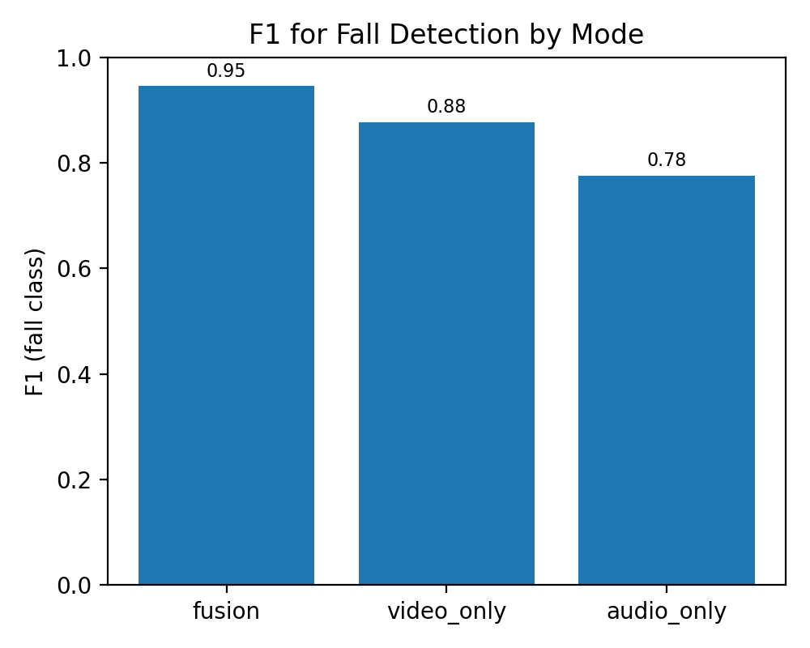
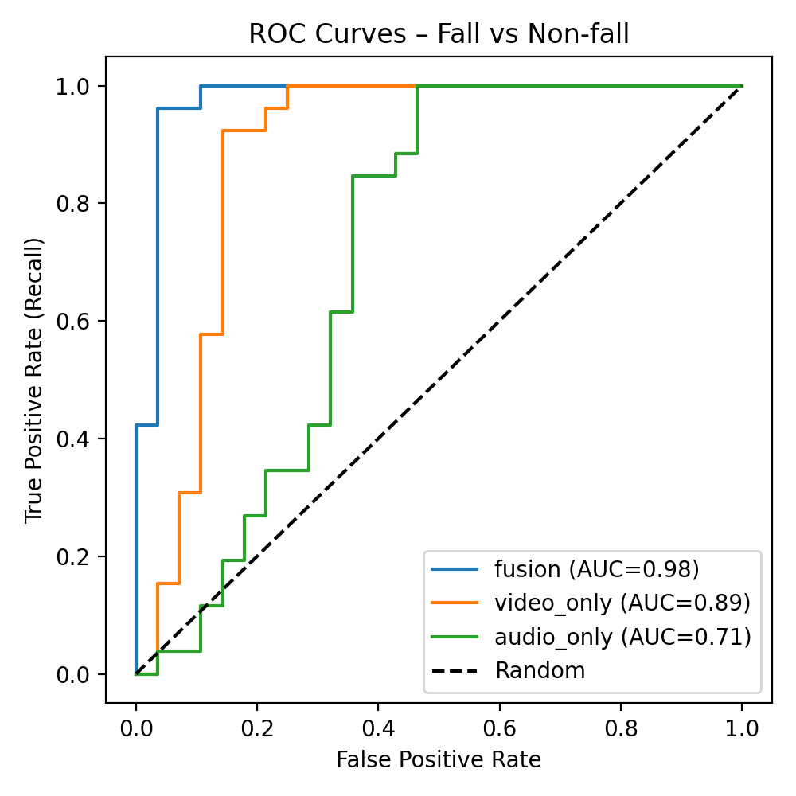
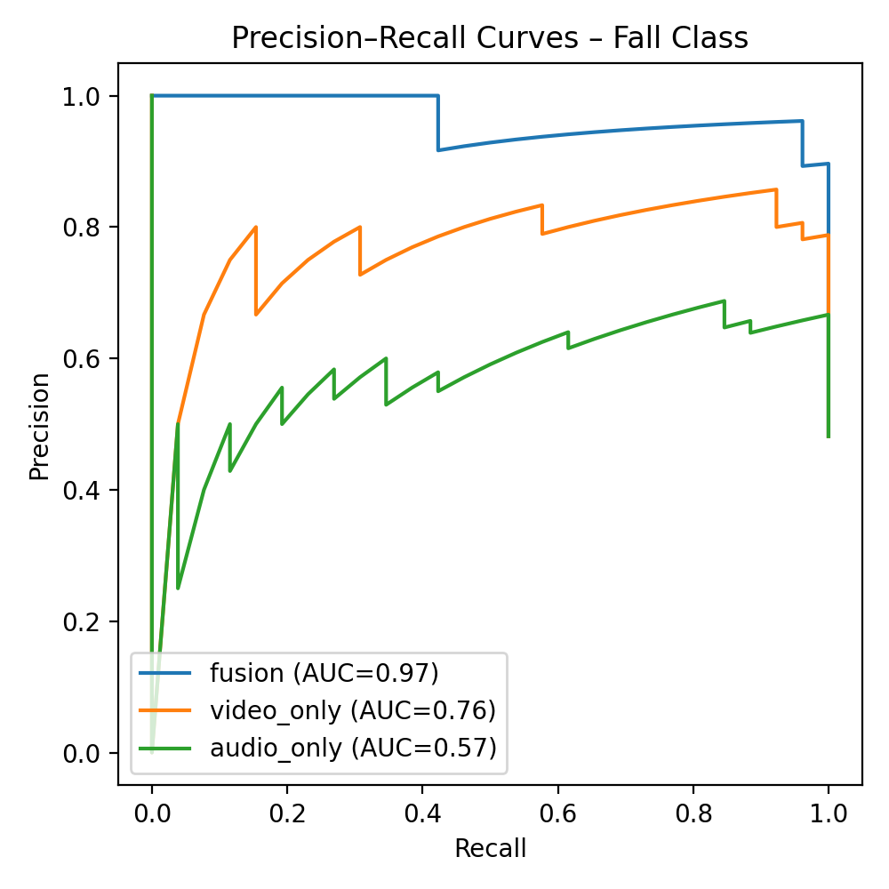

## Step 1: Question
Can we use multimodal data—(1) egocentric **video** from a body-worn camera and (2) synchronized ambient **audio**—to accurately detect whether a short clip corresponds to a fall vs non-fall event, using only a small subset of **375 clips** from the EGOFALLS dataset?


## Step 2: Dataset and EDA
### Dataset
**EGOFALLS** is an egocentric fall-detection dataset collected in Groningen, Netherlands (2018–2022). It includes 14 subjects (age 20–60) performing scripted activities with body-worn RGB cameras at the neck and waist, across indoor and outdoor environments. Overall there are 10,948 clips (7,177 non-falls, 3,771 falls). Clips are organized on disk by subject, environment (indoor/outdoor), activity type (falls vs non-falls), and more fine-grained categories such as "front_falls/Neck" or "Bending/Waist" in a nested folder tree.

Each Folder is named as a:
1) **Label**, binary indicator
    - **fall** – scripted falls such as front, lateral, backside, or syncopal falls.
    - **non-fall** – daily activities such as bending, standing, sitting, lying, stumbling, and walking.

2) and have `.MOV` file that contains a video stream and audio stream in the same container with no way to no separate .wav/.mp3 audio files
    - **Video**: RGB footage from a body-worn camera, capturing first-person motion (e.g., walking, sitting down, simulated falls).
    - **Audio**: Synchronized ambient sound, including footsteps, impact sounds, voices, and background noise.

### Basic EDA
Each folder name show a rich set of **non-fall** activities (bending, lying, rising, sitting, standing, walking, stumbling) and several **fall** types (backward, frontal, lateral, syncopal). This suggests the dataset covers a range of realistic motion patterns and potential confounders for a fall detector.


## Step 3: Missing Data, Outliers, Metadata, Manipulations
### Missingness
In terms of missing data, `.MOV`s are absent in some folders after unzipping (e.g., specific numbered clips like Neck_6.MOV) and as a result, attempting to load these raised a `FileNotFoundError`.

### Outliers
In terms of outliers, many of the clip `.MOV`s varied by length and some clips behaved like outliers from a modeling perspective. For example, non-fall activities such as stumbling, dropping an object, or sitting down abruptly, which can look or sound very similar to a true fall, as well as clips with unusually noisy background audio. I did not remove these clips because clinically they represent exactly the kinds of hard negatives that trigger false alarms in a real system.

During  metadata preparation, I filtered out any paths that did not correspond to an existing file. As a result, the final metadata only includes clips.

### MetaData
I walked the directory tree and built annotations.csv, labeling each `.MOV` file as:
 - **label = 1**, if its path contained a falls folder.
 - **label = 0**, if it came from a non-falls folder.

### Final Data Manipualtion
In terms of extracted clip-level metadata, an unzipping of the files and label balance (raw subset) included 894 clips total with 719 labeled as non-fall and 175 labeled as fall. **Due to large storage and memory contraints** of `.MOV` and `.mp4` files, this project consisted of a small dataset of 350 samples.
 - 175 falls
 - 175 non-falls 

This 350-clip balanced set is what the models are actually trained and evaluated on. It is then split, with a fixed random seed, into:
 - Train: 244 clips (~70%)
 - Validation: 52 clips (~15%)
 - Test: 54 clips (~15%)

## Step 4: Models
There are 3 models (fusion, video-only, audio-only) and follow the same basic recipe:

> Take a clip → turn it into a video feature and/or audio feature → feed through a small classifier to predict non-fall vs fall.

All models follow the same pattern:

1. **Inputs per clip**

   * **Video:** one middle RGB frame, resized to **3×224×224**, ImageNet-normalized.
   * **Audio:** up to **4 secons** of audio → **64-bin log-mel** vector (64-D).

2. **Encoders**

   * **Video encoder:** pretrained **ResNet18** (frozen), last layer removed → **512-D**, then a small head maps 512 → **128-D** (ReLU + dropout).
   * **Audio encoder:** small MLP maps **64-D → 64-D** (ReLU + dropout).

3. **Classifier / fusion**

   * **Fusion model:** concatenate 128-D video + 64-D audio → **192-D fused feature**, then a small MLP → **2 logits** (non-fall, fall).
   * **Video-only / audio-only:** use just one encoder (128-D or 64-D) with a similar small MLP → 2 logits.

All variants are trained with the **same loss** (cross-entropy), same optimizer (Adam), and the same train/val/test splits; the only difference between models is which encoders are turned on (video, audio, or both).


**Fusion Model**
```text

           ┌─────────────────────┐
           │  EGOFALLS clip      │
           │  (.MOV: video+audio)│
           └─────────┬───────────┘
                     │
        ┌────────────┴─────────────┐
        │                          │
        ▼                          ▼
┌──────────────────┐       ┌─────────────────────┐
│  Middle RGB frame│       │  4s audio waveform │
│  (3×224×224)     │       │  → log-mel (64-D)  │
└────────┬─────────┘       └─────────┬──────────┘
         │                           │
         ▼                           ▼
┌──────────────────┐       ┌─────────────────────┐
│  ResNet18 (frozen│       │  Audio MLP          │
│  backbone)       │       │  64 → 64, ReLU, DO │
│  3×224×224→512-D │       │  → 64-D embedding  │
└────────┬─────────┘       └─────────┬──────────┘
         │                           │
   512-D │                    64-D   │
         ▼                           ▼
┌──────────────────┐       ┌─────────────────────┐
│  Linear 512→128  │       │ (already 64-D)      │
│  ReLU, Dropout   │       └─────────────────────┘
│  → 128-D video   │                |
│    embedding     │                |
└────────┬─────────┘                 |
         │                           |
         |                           |
         ▼                            ▼ 
         ┌───────────────────────────┐
         │        128-D video        |
         │         64-D audio        |
         └───────┬───────────────────┘
                 ▼
        ┌─────────────────────────────┐
        │   Concatenate [128+64]      │
        │   → 192-D fused feature     │
        └───────────┬────────────────┘
                    ▼
        ┌─────────────────────────────┐
        │  Classifier MLP            │
        │  192 → 128 → 2 logits      │
        │  (non-fall, fall)          │
        └─────────────────────────────┘

```

**Video-Only Model**
``` text
           ┌─────────────────────┐
           │  EGOFALLS clip      │
           │  (.MOV)             │
           └─────────┬───────────┘
                     │
                     ▼
            ┌──────────────────┐
            │  Middle RGB frame│
            │  (3×224×224)     │
            └────────┬─────────┘
                     ▼
            ┌──────────────────┐
            │ ResNet18 (frozen)│
            │ 3×224×224→512-D  │
            └────────┬─────────┘
               512-D │
                     ▼
            ┌──────────────────┐
            │ Linear 512→128   │
            │ ReLU, Dropout    │
            │ → 128-D video    │
            │   embedding      │
            └────────┬─────────┘
                     ▼
            ┌──────────────────┐
            │ Classifier MLP   │
            │ 128 → 128 → 2    │
            │ (non-fall, fall) │
            └──────────────────┘
```

**Sound-Only Model**
```text
           ┌─────────────────────┐
           │  EGOFALLS clip      │
           │  (.MOV)             │
           └─────────┬───────────┘
                     │
                     ▼
            ┌───────────────────────┐
            │  4s audio waveform    │
            │  → log-mel (64-D)     │
            └──────────┬────────────┘
                       ▼
            ┌───────────────────────┐
            │ Audio MLP             │
            │ 64 → 64, ReLU, DO     │
            │ → 64-D audio embedding│
            └──────────┬────────────┘
                       ▼
            ┌───────────────────────┐
            │ Classifier MLP        │
            │ 64 → 64 → 2           │
            │ (non-fall, fall)      │
            └───────────────────────┘

```

## Step 5: Evalute Model

### Classic Metrics Definitions
This project defines each **clip** as a short, synchronized audio–video segment from the EGOFALLS dataset, recorded from an egocentric (body-worn) camera with ambient audio and labeled as either *fall* or *non-fall*. All metrics below are computed over these clips, treating **fall** as the positive class.

* **Loss** – Training objective the model minimizes; lower loss means predictions match the ground-truth labels better.
* **Accuracy** – Proportion of all clips (falls + non-falls) that are classified correctly.
* **Precision (Fall)** – Of all clips predicted as *falls*, the fraction that are actually falls (how many alarms are correct).
* **Recall (Fall)** – Of all true *fall* clips, the fraction the model correctly detects (how many falls we catch).
* **F1 (Fall)** – Harmonic mean of precision and recall for the fall class; high only when both are strong.
* **ROC AUC (Fall)** – Area under the ROC curve treating “fall” as the positive class; measures how well the model separates falls from non-falls across thresholds.
* **PR AUC (Fall)** – Area under the precision–recall curve for the fall class; especially informative when falls are relatively rare.
* **TP / FP / FN / TN** – Confusion matrix counts: true positives (correct falls), false positives (non-falls flagged as falls), false negatives (missed falls), and true negatives (correct non-falls).

### Which metrics matter and why?
In a real hospital deployment, the goal is **not** “get the highest accuracy number.” The goal is:

1. **Don’t miss real falls** (patient safety).
2. **Don’t spam staff with useless alerts** (avoid alarm fatigue).

Those two goals map almost directly to:

* **Recall (Fall)** – *Of all true falls, how many did we catch?*

  * This matters because a missed fall (false negative) can mean an unwitnessed injury or delayed care.
  * Clinically, **high recall is non-negotiable**: we’d rather slightly over-alert than miss a patient on the floor.

* **Precision (Fall)** – *Of all the clips we flagged as falls, how many were really falls?*

  * This matters because every false positive is an unnecessary alert.
  * If precision is low, nurses get bombarded with alarms and start ignoring them (**alarm fatigue**).

Because we care about **both** “catch almost all falls” (recall) **and** “don’t cry wolf all the time” (precision), I use:

* **F1 (Fall)** as a **single summary metric** – it is only high when **both precision and recall are high**, so it reflects a good trade-off between safety and alarm burden.
* **PR AUC (Fall)** instead of just ROC AUC – PR AUC directly measures how **precision and recall behave across thresholds**, which is more meaningful when falls are relatively rare. ROC AUC can look good even for models that still generate many useless alerts; PR AUC penalizes that more honestly.

In contrast, **accuracy** can be very misleading here: if falls are rare, a model that almost always predicts “non-fall” can have high accuracy while being **clinically useless**. That’s why, for this project, I treat **F1 (Fall), recall, precision, and PR AUC** as the metrics that actually matter for patient care.

### Performance
| Mode       | Loss  | Accuracy | F1 (Fall) | Recall (Fall) | Precision (Fall) | ROC AUC (Fall) | TP | FP | FN | TN |
| ---------- | ----- | -------- | --------- | ------------- | ---------------- | -------------- | -- | -- | -- | -- |
| fusion     | 0.179 | **0.944**    | **0.945**     | **1.000**         | **0.897**            | 0.977          | 26 | 3  | 0  | 25 |
| video_only | 0.426 | 0.870    | 0.877     | 0.962         | 0.806            | 0.887          | 25 | 6  | 1  | 22 |
| audio_only | 0.505 | 0.722    | 0.776     | 1.000         | 0.634            | 0.713          | 26 | 15 | 0  | 13 |

The fusion model clearly performs best, achieving the highest accuracy (0.944) and perfect recall for falls (1.000) with strong precision (0.897), meaning it catches all falls while keeping false alarms relatively low. The video-only model is decent but noticeably worse, especially in precision and overall accuracy, while the audio-only model lags behind both, with much lower accuracy (0.722) and a high number of false positives, making it less reliable on its own.



The Fall vs Non-fall F1 plot shows that multimodal fusion (audio + video) gives the strongest fall detection performance, with an F1 of 0.95, clearly above either single modality. Video-only does reasonably well at 0.88, but still underperforms fusion, while audio-only trails at 0.78, suggesting that audio alone misses more of the nuanced patterns needed for reliable fall detection. Overall, combining modalities consistently tightens performance and reduces the gap between precision and recall for the fall class.


The Fall vs Non-fall ROC curves show that the fusion model delivers the most robust discrimination between falls and non-falls, with an AUC of 0.98, staying close to the top-left corner across thresholds. The video-only model performs reasonably well (AUC ≈ 0.89), while the audio-only model lags behind (AUC ≈ 0.71), indicating substantially more overlap between fall and non-fall predictions when relying on audio alone.


The Fall vs Non-fall PR curves highlight that the fusion model not only detects falls but does so with consistently high precision, achieving a PR AUC of 0.97 and maintaining strong precision even at high recall. The video-only model is noticeably weaker (PR AUC ≈ 0.76), and the audio-only model struggles the most (PR AUC ≈ 0.57), confirming that multimodal fusion is especially valuable when we care about catching falls without flooding the system with false alarms.


### Interpretibility -- What the Model Means in Practice
Focusing on the best model, the Fusion model, on the held-out 54-clip test set, the **fusion model** produced:

* **TP = 26** – true falls correctly flagged
* **FP = 3** – non-falls incorrectly flagged as falls
* **FN = 0** – falls missed
* **TN = 25** – non-falls correctly ignored

In plain language, that means:

* When the system **fires an alert**, about **26 out of 29 alerts are real falls**, and about **3 out of 29 are false alarms**.
* On this test set, the model **did not miss any falls** (recall = 1.0), which is exactly what you want for patient safety.

Clinically, this trade-off matters because:

* **Missed falls (FN)** are the worst outcome: a patient may be on the floor without help, with risk of head injury, fracture, or delayed treatment.
* **False positives (FP)** drive **alarm fatigue**: if the system cries wolf too often, staff start ignoring alerts, which eventually undermines the whole point of monitoring.

This fusion model is tuned toward **“safety first”**: it prioritizes **very high recall** (catch every fall in the test set) while keeping the number of false alarms relatively modest. If you scale this behavior up, you can think of it roughly as:

> “For every ~10 fall alerts, about 9 would be real falls and ~1 would be a false alarm.”

## Step 6: Future Steps for Production Models

If this system were deployed on a wearable, accuracy wouldn’t be the only concern, **edge constraints** suddenly matter a lot. Current devices have limited compute, battery, and network bandwidth, so the model has to be intentionally lightweight. In this design, each decision uses just a single 224×224 frame and a 4-second audio window, with a frozen ResNet18 backbone so there’s no heavy backprop or large updates happening on-device. In practice, the wearable would continuously buffer a few seconds of audio–video, run inference periodically (e.g., every few seconds), and only transmit a small alert payload—a timestamp, risk score, and possibly a representative frame—to the nurse dashboard when a risk threshold is crossed, keeping both computation and communication costs low.

## Step 7: Retrain and Iterate on the ModelS

Once deployed, the model shouldn’t be static and there are several ways to iterate the model:

1. **Continuous data collection & labeling.**

   * Every alert + a sample of non-alert clips can be stored and periodically reviewed.
   * Mis-labeled events (false alarms, missed falls) become new training examples.

2. **Retraining schedule.**

   * Offline, say **monthly or quarterly**, we can:

     * Merge new labeled clips with the existing training set and Re-run training and compare metrics to the previous model.

3. **Future Integration with clinical workflow.**

   * Fall alerts could be logged in the EMR, timestamped and linked to room and patient.
   * Clinicians could review short, anonymized clips for quality assurance and label corrections (useful for retraining).

